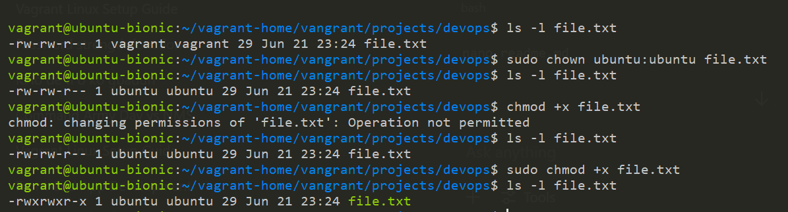
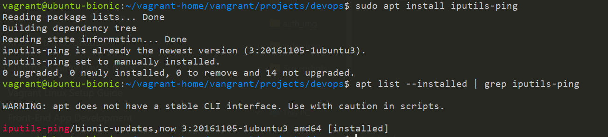
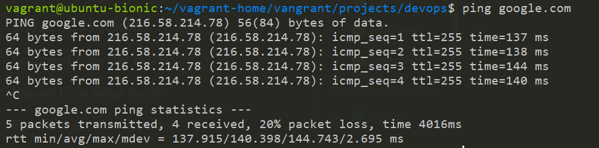

# linux-fundamental-vagrant-alemohchristian

> 📝 **Note:** I initialized the VM using `vagrant init ubuntu/bionic64`, then used `vagrant up` and `vagrant ssh`.

> 📝 **Note:** I used `mkdir -p /home/vagrant/projects/devops` to create the folder structure and confirmed it with `ls`.and used `tree` to display the folder structure

> 📝 **Note:** The file demo.txt was created with the current user as owner (likely vagrant).

>The sudo chown ubuntu demo.txt command changed the file’s owner to ubuntu.
>Running `ls -l` before and after shows the ownership change:
>From: vagrant vagrant
>To: ubuntu vagrant
>Ownership controls who can manage or modify a file. Using chown ensures the right user has control.

> 📝 **Note:** I installed the `iputils-ping` package using the apt package manager. This package provides the ping command, which is useful for checking network connectivity between my virtual machine and remote servers.After installation, I confirmed it by running:ping --version

> 📝 **Note:** I used `ping google.com` to test remote connectivity. The result shows **20% packet loss**, meaning some packets did not reach or return from the server. This could be caused by:
> - Unstable internet connection on my host machine
> Despite the packet loss, the successful responses show that the VM is connected to the internet.
