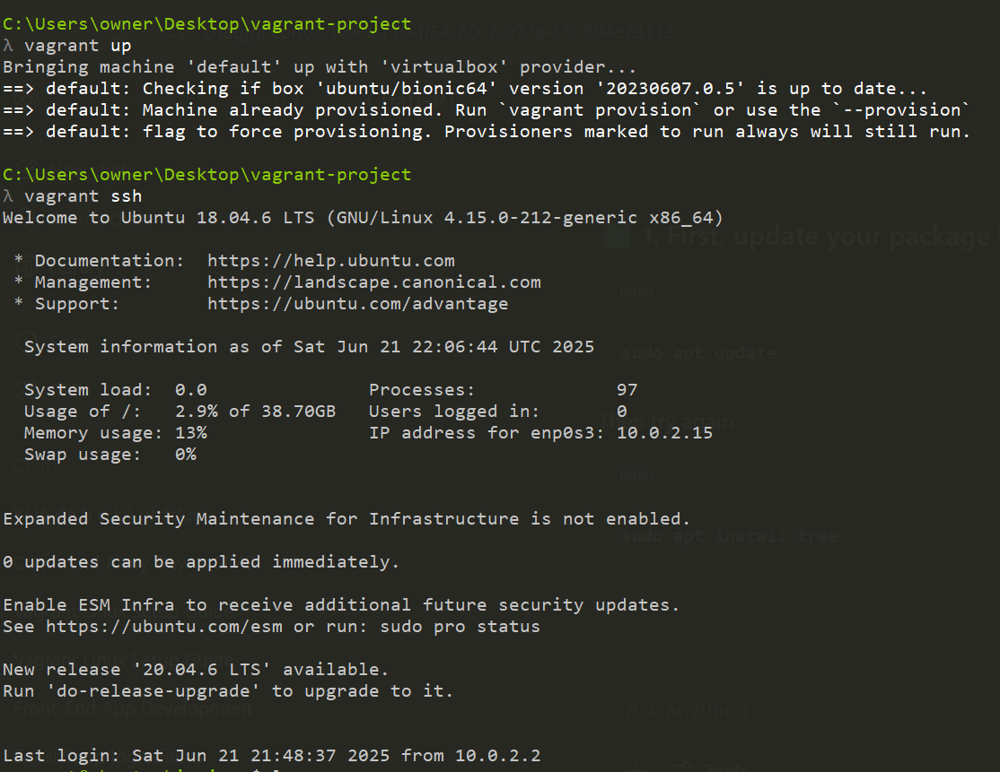
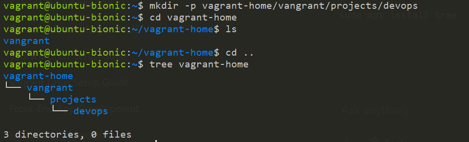

# linux-fundamental-vagrant-alemohchristian

> 📝 **Note:** I initialized the VM using `vagrant init ubuntu/bionic64`, then used `vagrant up` and `vagrant ssh`.

> 📝 **Note:** I used `mkdir -p /home/vagrant/projects/devops` to create the folder structure and confirmed it with `ls`.and used `tree` to display the folder structure
